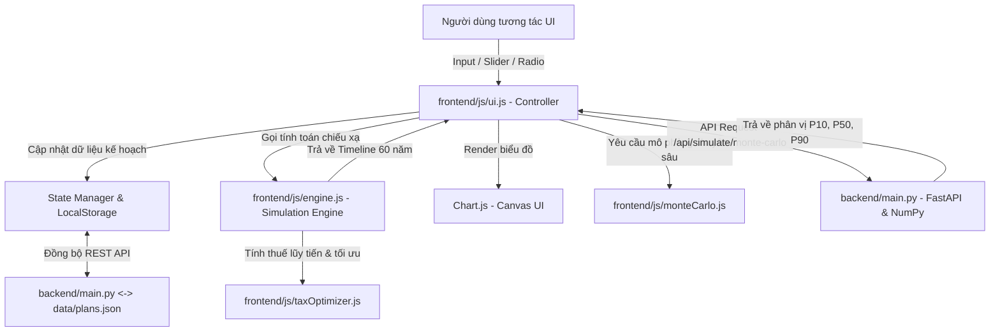

# Kiến Trúc Hệ Thống pyRetrait (Architecture Documentation)

Tài liệu này mô tả chi tiết kiến trúc kỹ thuật, luồng dữ liệu, các module tính toán và cấu trúc mã nguồn của nền tảng **pyRetrait**.

---

## 1. Tổng quan Kiến trúc (High-Level Overview)

pyRetrait được thiết kế theo triết lý **Local-First & Reactive Realtime Architecture**:
- **Bảo mật & Quyền riêng tư tối đa**: Toàn bộ dữ liệu tài chính nhạy cảm được lưu trữ trực tiếp trên máy của người dùng (Client `localStorage` và tệp cục bộ `data/plans.json`).
- **Phản hồi tức thì (<16ms)**: Mọi thao tác thay đổi tham số (lương, tỷ lệ tiết kiệm, tuổi nghỉ hưu, lạm phát, tỷ suất lợi nhuận) đều kích hoạt engine tính toán lại toàn bộ dòng đời (life-cycle projection) và vẽ lại biểu đồ ngay lập tức mà không cần tải lại trang.
- **Tính toán 2 tầng (Client-Side Engine & Server-Side Monte Carlo)**:
  - **Tầng 1 (Frontend Engine - Vanilla JS)**: Thực hiện mô phỏng dòng tiền 50-80 năm, áp dụng các chiến lược rút tiền, tính thuế lũy tiến và phân bổ tỷ lệ chi tiêu/tiết kiệm.
  - **Tầng 2 (Backend Engine - Python FastAPI & NumPy)**: Xử lý các phép toán mô phỏng ngẫu nhiên ma trận lớn (Monte Carlo 1,000 - 10,000 đường cong lợi nhuận ngẫu nhiên với phân phối Gaussian).



---

## 2. Chi tiết các Module Frontend (`frontend/js/`)

### 2.1. `engine.js` — Lõi Tính toán Dòng tiền & Tích lũy (Core Projection Engine)
- **Chu kỳ vòng lặp theo từng năm tuổi (`age` từ `currentAge` đến `lifeExpectancy`)**:
  1. **Tính tổng thu nhập (`annualIncome`)**: Tổng hợp từ tất cả các luồng thu nhập chủ động và thụ động (`plan.incomes`) đang có hiệu lực tại độ tuổi đó, áp dụng tỷ lệ tăng lương riêng biệt của từng luồng.
  2. **Ước tính thuế thu nhập (`estimatedTax`)**: Chuyển giao sang `taxOptimizer.js` để tính theo Biểu thuế lũy tiến Pháp (IR 2024), Mỹ (US Federal), hoặc Việt Nam.
  3. **Phân bổ giai đoạn tích lũy (`!isRetired`)**:
     - Áp dụng **Tỷ lệ Tiết kiệm (`savingsRate`)**:
       $$\text{Tiết kiệm năm} = \text{Thu nhập sau thuế} \times \frac{\text{savingsRate}}{100}$$
       $$\text{Chi tiêu sinh hoạt} = \text{Thu nhập sau thuế} \times \left(1 - \frac{\text{savingsRate}}{100}\right)$$
     - Tài sản danh mục tăng trưởng theo lãi kép hàng năm:
       $$\text{Portfolio}_{t+1} = (\text{Portfolio}_t + \text{Tiết kiệm}) \times (1 + r_{\text{pre}})$$
  4. **Phân bổ giai đoạn hưu trí (`isRetired`)**:
     - Áp dụng chiến lược rút tiền được chọn (`bengen_4pct`, `guyton_klinger`, `vpw`, `fixed_pct`).
     - Tự động cộng các nguồn thu nhập tuổi già (Lương hưu Pháp CNAV/Agirc-Arrco từ 65 tuổi, cổ tức, bất động sản).
     - **Tái đầu tư thặng dư**: Nếu thu nhập thụ động > Chi tiêu sinh hoạt, thặng dư được tái đầu tư trở lại vào danh mục. Ngược lại, khoản thiếu hụt (`deficit`) sẽ được rút từ danh mục đầu tư.
  5. **Mô hình Chi tiêu Spending Smile**: Điều chỉnh chi tiêu theo 3 chặng Go-Go, Slow-Go, No-Go.

### 2.2. `taxOptimizer.js` — Bộ Tối ưu Hóa Thuế & Phúc lợi Xã hội
- **Biểu thuế lũy tiến Pháp (IR 2024)**:
  - Tự động trừ **10% Abattement forfaitaire pour frais professionnels** (trần 14,171 €).
  - 5 bậc thuế chính thức: 0% ($\le 11,294 €$), 11%, 30%, 41%, 45%.
  - Thuế suất ưu đãi cho tài khoản PEA (miễn thuế thu nhập sau 5 năm).
- **Bộ tính Lương hưu Pháp (French Pension Reform 2023)**:
  - Tính toán dựa trên số quý đóng góp (`trimestres`), tuổi tối thiểu (64 tuổi theo cải cách 2023) và tuổi hưởng tỷ lệ tối đa không bị phạt (67 tuổi).
- **Roth Conversion Ladder & ACA Subsidy**: Hỗ trợ thị trường Mỹ với chiến lược chuyển đổi quỹ truyền thống sang Roth IRA vào các năm trũng thu nhập.

### 2.3. `scenarios.js` — Động cơ Stress Test & Kịch bản What-If
- Cung cấp các kịch bản kiểm thử rủi ro:
  - **Khủng hoảng thị trường sớm (Market Crash -35%)**: Xảy ra ngay ở 2 năm đầu nghỉ hưu để kiểm tra Sequence of Returns Risk.
  - **Lạm phát cao kéo dài (High Inflation)**: Tăng 30% chi phí sinh hoạt trong 5 năm liên tiếp.
  - **Cú sốc y tế (Medical Shock)**: Phát sinh chi phí đột xuất ở tuổi 65.
  - **Thu gọn BĐS (Downsizing)**: Bơm dòng tiền ròng vào danh mục ở tuổi 60.
- Đánh giá mức độ ảnh hưởng của từng kịch bản tới tỷ lệ thành công và tài sản cuối kỳ của kế hoạch.

### 2.4. `patrimoine.js` — Quản Lý Danh Mục BĐS LMNP & Đội Xe Turo
- Quản lý trạng thái danh mục bất động sản tại Pháp và đội xe Turo:
  - Tải và đồng bộ danh sách căn hộ từ Backend (`/api/patrimoine/apartments`).
  - Tính toán tổng giá trị tài sản, dư nợ ngân hàng, tiền trả góp hàng tháng (*mensualités*), dòng tiền ròng sau thuế khấu hao LMNP.
  - Quản lý modal thêm/sửa/xóa căn hộ (Modal CRUD).
  - **1-Click Sync to FIRE Engine**: Tự động chuyển đổi các dòng tiền bất động sản thành các nguồn thu `plan.incomes` với mốc thời gian trước/sau khi tất toán nợ.

### 2.5. `ui.js` — Bộ điều khiển Giao diện & Tương tác Thời gian thực
- Quản lý trạng thái (`state.plansData`, `state.currency`, `state.activeTab`).
- Xử lý chuyển đổi tiền tệ đa chiều (EUR $\leftrightarrow$ VND $\leftrightarrow$ USD) với tỷ giá thị trường cố định hoặc tùy chỉnh.
- Liên kết 2 chiều giữa Tỷ lệ tiết kiệm (Slider / Nút bấm tỷ lệ nhanh 1/4, 1/3, 1/2, 2/3) và ô nhập tiền mặt.
- Quản lý các Modal: Thêm/Sửa luồng thu nhập, Tạo kế hoạch mới, Cố vấn Gemini AI.
- Khởi tạo và cập nhật các biểu đồ **Chart.js** (Net Worth Trajectory, Cash-Flow Projections, Monte Carlo Fanchart, Withdrawal Comparison).

### 2.6. Kiến trúc Giao diện Đóng Băng (Frozen Sidebar Architecture)
- Thiết lập theo mô hình **Independent Scroll Containers**:
  - `html, body { height: 100vh; overflow: hidden; }`
  - `.top-nav`: Cố định với `height: 64px; flex-shrink: 0;`
  - `.app-layout`: Chiếm trọn khung nhìn còn lại `height: calc(100vh - 64px); display: flex; overflow: hidden;`
  - `.sidebar`: Cố định 100% chiều cao (`width: 250px; flex-shrink: 0;`), các icon nằm ngang bên trái text (`flex-direction: row`) giúp thu gọn chiều cao tab xuống ~38px.
  - `.main-content`: Cuộn độc lập `flex: 1; height: 100%; overflow-y: auto;`.

---

## 3. Kiến trúc Backend (`backend/`) & Tích hợp pyLocation

Backend được viết bằng **Python 3.10+** với framework **FastAPI**, giữ vai trò:
1. **File Persistence**: Đọc/ghi cấu trúc JSON vào `data/plans.json` và `data/patrimoine.json`.
2. **High-Performance Monte Carlo**: Sử dụng `numpy.random.normal` để sinh ma trận ngẫu nhiên $1,000 \times 60$ bước thời gian trong vòng dưới 15ms.
3. **Gemini AI Proxy (`/api/advisor/gemini`)**: Gọi Google Gemini 2.5 API để phân tích chiến lược tài chính toàn diện, tính toán tuổi nghỉ hưu tối ưu kèm cơ chế Heuristic Fallback khi offline.
4. **pyLocation Engine Integration**: Kế thừa thuật toán khấu hao tài sản LMNP, tính lãi vay ngân hàng Pháp và đội xe Turo.

### Các Endpoint API chính:
- `GET /api/plans`: Trả về toàn bộ danh sách kế hoạch đã lưu.
- `POST /api/plans`: Lưu toàn bộ trạng thái kế hoạch xuống đĩa cứng.
- `POST /api/simulate/monte-carlo`: Chạy mô phỏng Monte Carlo 1,000 kịch bản và trả về các phân vị P10, P25, P50 (Trung vị), P75, P90 cùng xác suất thành công.
- `GET /api/patrimoine/apartments`: Lấy danh sách căn hộ BĐS Pháp và thông số vay nợ.
- `POST /api/patrimoine/apartments`: Cập nhật / lưu danh mục căn hộ vào `data/patrimoine.json`.
- `POST /api/advisor/gemini`: Nhận xét và đánh giá kế hoạch FIRE từ Gemini AI.

---

## 4. Mô hình Dữ liệu (Plan Schema)

Cấu trúc một đối tượng kế hoạch trong `data/plans.json`:

```json
{
  "id": "plan_franco_viet",
  "name": "🇫🇷 ➔ 🇻🇳 Kế hoạch Franco-Viet FIRE",
  "currency": "EUR",
  "currentAge": 29,
  "retirementAge": 42,
  "lifeExpectancy": 85,
  "currentSavings": 10000,
  "savingsRate": 33.33,
  "annualSavings": 26667,
  "annualExpenses": 53333,
  "retirementExpenses": 10000,
  "inflationRate": 2.5,
  "investmentReturnPre": 8.0,
  "investmentReturnPost": 7.5,
  "withdrawalStrategy": "vpw",
  "initialWithdrawalRate": 4.0,
  "targetLegacy": 100000,
  "taxRegime": "france_vietnam",
  "incomes": [
    {
      "name": "Lương tại Pháp (Net après impôt)",
      "amount": 80000,
      "startAge": 29,
      "endAge": 42,
      "growth": 3.5,
      "taxable": true
    }
  ]
}
```
