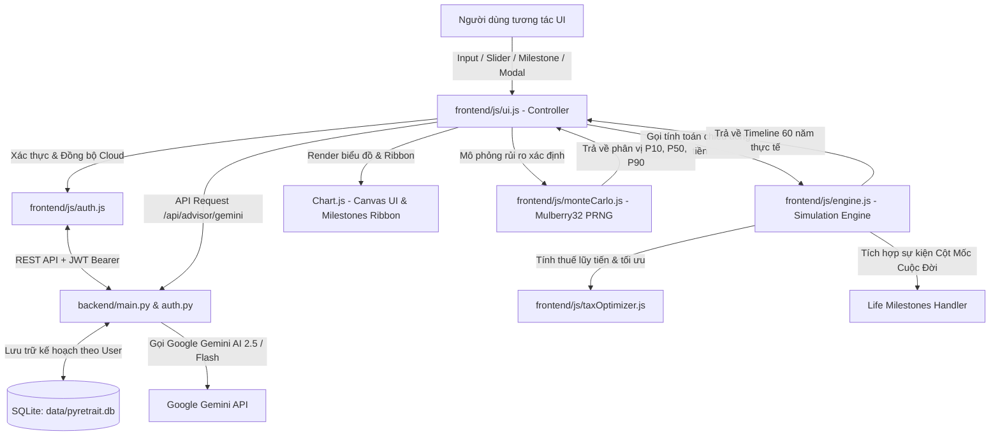

# Kiến Trúc Hệ Thống pyRetrait (Architecture Documentation)

Tài liệu này mô tả chi tiết kiến trúc kỹ thuật, luồng dữ liệu, các module tính toán và cấu trúc mã nguồn của nền tảng **pyRetrait**.

---

## 1. Tổng quan Kiến trúc (High-Level Overview)

pyRetrait được thiết kế theo triết lý **Local-First & Reactive Realtime Architecture kết hợp Cloud Multi-Tenant Sync**:
- **Bảo mật & Quyền riêng tư tối đa**: Dữ liệu tài chính hỗ trợ 2 chế độ: Chế độ Khách (Guest) lưu trữ độc quyền trên `localStorage` và Chế độ Tài khoản (Cloud) lưu trữ độc lập trên SQLite (`data/pyretrait.db`), mật khẩu mã hóa PBKDF2/SHA-256 + muối an toàn.
- **Phản hồi tức thì (<16ms)**: Mọi thao tác thay đổi tham số (lương, tỷ lệ tiết kiệm, tuổi nghỉ hưu, lạm phát, tỷ suất sinh lời, thêm sự kiện cột mốc) đều kích hoạt engine tính toán lại toàn bộ dòng đời (life-cycle projection) và vẽ lại biểu đồ ngay lập tức mà không cần tải lại trang.
- **Tính toán 2 tầng (Client-Side Deterministic Engine & Server-Side Heavy Compute)**:
  - **Tầng 1 (Frontend Engine - Vanilla JS)**: Thực hiện mô phỏng dòng tiền 50-80 năm, áp dụng các chiến lược rút tiền, tính thuế lũy tiến, phân bổ chi tiêu/tiết kiệm và mô phỏng Monte Carlo xác định bằng thuật toán **Mulberry32 PRNG (Seed 42)**.
  - **Tầng 2 (Backend Engine - Python FastAPI & SQLite)**: Xử lý xác thực người dùng (JWT), lưu trữ đa tài khoản, và proxy AI phân tích chiến lược qua Google Gemini Flash.



---

## 2. Chi tiết các Module Frontend (`frontend/js/`)

### 2.1. `engine.js` — Lõi Tính toán Dòng tiền & Tích lũy (Core Projection Engine)
- **Chu kỳ vòng lặp theo từng năm tuổi (`age` từ `startWorkAge` đến `lifeExpectancy`)**:
  1. **Timeline quá khứ thực tế**: Tính toán trung thực dựa trên thu nhập và cấu hình thực tế, loại bỏ hoàn toàn các hàm ước lượng đa thức giả định.
  2. **Tính tổng thu nhập (`annualIncome`)**: Tổng hợp từ tất cả các luồng thu nhập chủ động và thụ động (`plan.incomes`) đang có hiệu lực tại độ tuổi đó, áp dụng tỷ lệ tăng lương riêng biệt của từng luồng.
  3. **Ước tính thuế thu nhập (`estimatedTax`)**: Chuyển giao sang `taxOptimizer.js` để tính theo Biểu thuế lũy tiến Pháp (IR 2024), Mỹ (US Federal), hoặc Việt Nam.
  4. **Phân bổ giai đoạn tích lũy (`!isRetired`)**:
     - Áp dụng **Tỷ lệ Tiết kiệm (`savingsRate`)**:
       $$\text{Tiết kiệm năm} = \text{Thu nhập sau thuế} \times \frac{\text{savingsRate}}{100}$$
       $$\text{Chi tiêu sinh hoạt} = \text{Thu nhập sau thuế} \times \left(1 - \frac{\text{savingsRate}}{100}\right)$$
     - Tài sản danh mục tăng trưởng theo lãi kép hàng năm:
       $$\text{Portfolio}_{t+1} = (\text{Portfolio}_t + \text{Tiết kiệm}) \times (1 + r_{\text{pre}})$$
  5. **Tích hợp Sự kiện Cột Mốc Cuộc Đời (`plan.milestones`)**:
     - Nếu năm đó có cột mốc chi tiêu đột xuất (ví dụ mua nhà, sinh con):
       $$\text{Portfolio}_t = \max\Big(0, \, \text{Portfolio}_t - \text{MilestoneExpense}\Big)$$
     - Nếu năm đó có cột mốc thu nhập đột xuất (ví dụ thừa kế, bán tài sản):
       $$\text{Portfolio}_t = \text{Portfolio}_t + \text{MilestoneIncome}$$
  6. **Phân bổ giai đoạn hưu trí (`isRetired`)**:
     - Áp dụng chiến lược rút tiền được chọn (`bengen_4pct`, `guyton_klinger`, `vpw`, `fixed_pct`).
     - Tự động cộng các nguồn thu nhập tuổi già (Lương hưu Pháp CNAV/Agirc-Arrco từ 65 tuổi, BHXH Việt Nam, cổ tức, bất động sản).
     - **Tái đầu tư thặng dư**: Nếu thu nhập thụ động > Chi tiêu sinh hoạt, thặng dư được tái đầu tư trở lại vào danh mục. Ngược lại, khoản thiếu hụt (`deficit`) sẽ được rút từ danh mục đầu tư.
  7. **Mô hình Chi tiêu Spending Smile**: Điều chỉnh chi tiêu theo 3 chặng Go-Go, Slow-Go, No-Go.

### 2.2. `taxOptimizer.js` — Bộ Tối ưu Hóa Thuế & Phúc lợi Xã hội
- **Biểu thuế lũy tiến Pháp (IR 2024)**:
  - Tự động trừ **10% Abattement forfaitaire pour frais professionnels** (trần 14,171 €).
  - 5 bậc thuế chính thức: 0% ($\le 11,294 €$), 11%, 30%, 41%, 45%.
  - Thuế suất ưu đãi cho tài khoản PEA (miễn thuế thu nhập sau 5 năm).
- **Bộ tính Lương hưu Pháp (French Pension Reform 2023)**:
  - Tính toán dựa trên số quý đóng góp (`trimestres`), tuổi tối thiểu (64 tuổi theo cải cách 2023) và tuổi hưởng tỷ lệ tối đa không bị phạt (67 tuổi).
- **Roth Conversion Ladder & ACA Subsidy**: Hỗ trợ thị trường Mỹ với chiến lược chuyển đổi quỹ truyền thống sang Roth IRA vào các năm trũng thu nhập.

### 2.3. `monteCarlo.js` — Mô Phỏng Monte Carlo Xác Định (Deterministic Mulberry32 PRNG)
- Sử dụng thuật toán sinh số giả ngẫu nhiên xác định **Mulberry32** với hạt giống cố định (`seed = 42`):
  - Triệt tiêu hoàn toàn sự chênh lệch ngẫu nhiên giữa các trình duyệt khác nhau (Google Chrome vs Brave Browser vs Safari).
  - Đảm bảo 1,000 chuỗi mô phỏng cho cùng một bộ dữ liệu đầu vào sẽ cho kết quả P10/P50/P90 và tỷ lệ thành công giống hệt nhau trên mọi thiết bị.
- Kết hợp biến đổi **Box-Muller** để chuyển đổi số ngẫu nhiên đều $[0, 1)$ thành phân phối chuẩn Gaussian với kỳ vọng sinh lời và độ biến động lịch sử.

### 2.4. `auth.js` — Quản Lý Xác Thực & Đồng Bộ Đa Người Dùng
- Quản lý trạng thái người dùng (Chế độ Khách vs Chế độ Tài khoản Đám mây).
- Lưu trữ JWT Token an toàn và tự động chèn header `Authorization: Bearer <token>` vào mọi yêu cầu API.
- **Migration thông minh**: Khi người dùng chuyển từ Chế độ Khách sang Đăng ký tài khoản, hệ thống tự động tải toàn bộ kế hoạch trên máy cá nhân lên server để không bị mất dữ liệu.

### 2.5. `scenarios.js` — Động cơ Stress Test & Kịch bản What-If
- Cung cấp các kịch bản kiểm thử rủi ro:
  - **Khủng hoảng thị trường sớm (Market Crash -35%)**: Xảy ra ngay ở 2 năm đầu nghỉ hưu để kiểm tra Sequence of Returns Risk.
  - **Lạm phát cao kéo dài (High Inflation)**: Tăng 30% chi phí sinh hoạt trong 5 năm liên tiếp.
  - **Cú sốc y tế (Medical Shock)**: Phát sinh chi phí đột xuất ở tuổi 65.
  - **Thu gọn BĐS (Downsizing)**: Bơm dòng tiền ròng vào danh mục ở tuổi 60.

### 2.6. `patrimoine.js` — Quản Lý Danh Mục BĐS LMNP & Đội Xe Turo
- Quản lý trạng thái danh mục bất động sản tại Pháp và đội xe Turo:
  - Tính toán lịch trả nợ vay ngân hàng (*amortissement*), phí công chứng tự động 7.5%, tỷ lệ phòng trống (*vacance locative*), thuế đất *taxe foncière*, dòng tiền ròng sau thuế khấu hao LMNP.
  - **1-Click Auto-Sync to FIRE Engine**: Tự động chuyển đổi các dòng tiền bất động sản thành các nguồn thu `plan.incomes` với mốc thời gian trước/sau khi tất toán nợ.

### 2.7. `ui.js` — Bộ Điều Khiển Giao Diện, Modal & Milestones Ribbon
- Quản lý trạng thái (`state.plansData`, `state.currency`, `state.activeTab`).
- Xử lý chuyển đổi tiền tệ đa chiều (EUR $\leftrightarrow$ VND $\leftrightarrow$ USD).
- **Life Milestones Ribbon**: Quản lý dải cờ sự kiện trên đầu biểu đồ Net Worth, hỗ trợ click highlight trục thời gian và nhấp đúp để mở nhanh modal chỉnh sửa.
- **Kiến trúc Modal Responsive Chống Tràn Màn Hình**:
  - Khung `.modal-card` có `max-height: calc(100dvh - 2rem)` và `display: flex; flex-direction: column`.
  - Header và Footer cố định tuyệt đối, nút **Lưu** và nút **Đóng** không bao giờ bị đẩy văng khỏi màn hình.
  - Phần thân `.modal-body` cuộn độc lập (`overflow-y: auto`), tự động cuộn đến form chỉnh sửa (`scrollIntoView`).
  - Hỗ trợ đóng modal linh hoạt bằng phím **Escape** và nhấp ra ngoài nền mờ backdrop.

---

## 3. Kiến trúc Backend (`backend/`)

Backend được viết bằng **Python 3.10+** với framework **FastAPI**, giữ vai trò:
1. **Xác thực Đa Người Dùng (`backend/auth.py`)**:
   - Quản lý tài khoản trong SQLite (`data/pyretrait.db`).
   - Mã hóa mật khẩu an toàn bằng `hashlib.pbkdf2_hmac` với muối ngẫu nhiên (salt) 32 bytes và 100,000 vòng lặp.
   - Cấp phát và xác thực JWT token (HS256) có thời hạn 30 ngày.
2. **Quản lý Dữ liệu Kế hoạch Theo User (`backend/main.py`)**:
   - Lưu trữ các kế hoạch độc lập theo từng `user_id`. Đảm bảo an toàn, không rò rỉ dữ liệu giữa các người dùng khi dùng chung đường link web.
3. **Gemini AI Strategy Advisor Proxy (`/api/advisor/gemini`)**:
   - Kết nối trực tiếp với Google Gemini 2.5 / Flash API, hỗ trợ tự động dò tìm model mới nhất từ Google và chế độ Heuristic Fallback khi offline.
4. **pyLocation Engine Integration**:
   - Kế thừa thuật toán khấu hao tài sản LMNP, tính lãi vay ngân hàng Pháp và đội xe Turo.

### Các Endpoint API chính:
- `POST /api/auth/register`: Đăng ký tài khoản mới.
- `POST /api/auth/login`: Đăng nhập và nhận JWT Bearer Token.
- `GET /api/auth/me`: Kiểm tra phiên làm việc người dùng hiện tại.
- `GET /api/plans`: Trả về toàn bộ danh sách kế hoạch của tài khoản.
- `POST /api/plans`: Lưu toàn bộ trạng thái kế hoạch vào SQLite database.
- `POST /api/advisor/gemini`: Nhận xét và đánh giá kế hoạch FIRE từ Gemini AI.
- `GET /api/patrimoine/apartments`: Lấy danh sách căn hộ BĐS Pháp và thông số vay nợ.
- `POST /api/patrimoine/apartments`: Cập nhật / lưu danh mục căn hộ.

---

## 4. Mô hình Dữ liệu (Plan Schema Mới Nhất)

Cấu trúc đối tượng kế hoạch bao gồm đầy đủ các luồng thu nhập và mốc sự kiện:

```json
{
  "id": "plan_franco_viet",
  "name": "🇫🇷 ➔ 🇻🇳 Kế hoạch Franco-Viet FIRE",
  "currency": "EUR",
  "currentAge": 29,
  "retirementAge": 42,
  "lifeExpectancy": 85,
  "currentSavings": 10000,
  "savingsRate": 33.33,
  "annualSavings": 26667,
  "annualExpenses": 53333,
  "retirementExpenses": 10000,
  "inflationRate": 2.5,
  "investmentReturnPre": 8.0,
  "investmentReturnPost": 7.5,
  "withdrawalStrategy": "vpw",
  "initialWithdrawalRate": 4.0,
  "targetLegacy": 100000,
  "taxRegime": "france_vietnam",
  "incomes": [
    {
      "name": "Lương tại Pháp (Net après impôt)",
      "amount": 80000,
      "startAge": 29,
      "endAge": 42,
      "growth": 3.5,
      "taxable": true
    }
  ],
  "milestones": [
    {
      "id": "ms_house_35",
      "name": "Mua nhà / Đặt cọc BĐS",
      "age": 35,
      "icon": "🏡",
      "type": "expense",
      "amount": 50000,
      "note": "Trích tiền từ danh mục đầu tư",
      "enabled": true
    },
    {
      "id": "ms_baby_33",
      "name": "Sinh con đầu lòng",
      "age": 33,
      "icon": "👶",
      "type": "none",
      "amount": 0,
      "note": "Mốc kỷ niệm gia đình",
      "enabled": true
    }
  ]
}
```ả về toàn bộ danh sách kế hoạch đã lưu.
- `POST /api/plans`: Lưu toàn bộ trạng thái kế hoạch xuống đĩa cứng.
- `POST /api/simulate/monte-carlo`: Chạy mô phỏng Monte Carlo 1,000 kịch bản và trả về các phân vị P10, P25, P50 (Trung vị), P75, P90 cùng xác suất thành công.
- `GET /api/patrimoine/apartments`: Lấy danh sách căn hộ BĐS Pháp và thông số vay nợ.
- `POST /api/patrimoine/apartments`: Cập nhật / lưu danh mục căn hộ vào `data/patrimoine.json`.
- `POST /api/advisor/gemini`: Nhận xét và đánh giá kế hoạch FIRE từ Gemini AI.

---

## 4. Mô hình Dữ liệu (Plan Schema)

Cấu trúc một đối tượng kế hoạch trong `data/plans.json`:

```json
{
  "id": "plan_franco_viet",
  "name": "🇫🇷 ➔ 🇻🇳 Kế hoạch Franco-Viet FIRE",
  "currency": "EUR",
  "currentAge": 29,
  "retirementAge": 42,
  "lifeExpectancy": 85,
  "currentSavings": 10000,
  "savingsRate": 33.33,
  "annualSavings": 26667,
  "annualExpenses": 53333,
  "retirementExpenses": 10000,
  "inflationRate": 2.5,
  "investmentReturnPre": 8.0,
  "investmentReturnPost": 7.5,
  "withdrawalStrategy": "vpw",
  "initialWithdrawalRate": 4.0,
  "targetLegacy": 100000,
  "taxRegime": "france_vietnam",
  "incomes": [
    {
      "name": "Lương tại Pháp (Net après impôt)",
      "amount": 80000,
      "startAge": 29,
      "endAge": 42,
      "growth": 3.5,
      "taxable": true
    }
  ]
}
```
