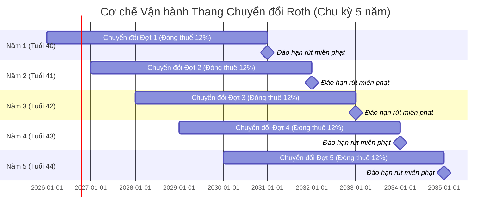

# 📘 Hướng Dẫn Chi Tiết: Thang Chuyển Đổi Roth (Roth Conversion Ladder) & Tối Ưu Trợ Cấp Y Tế (ACA Subsidies)

> **pyRetrait — Công cụ Hoạch định Độc lập Tài chính & Nghỉ hưu sớm (FIRE)**

---

## 📑 Mục Lục
1. [Tổng Quan: Hai Bài Toán Lớn Của Người Nghỉ Hưu Sớm](#1-tổng-quan-hai-bài-toán-lớn-của-người-nghỉ-hưu-sớm)
2. [Chiến Lược 1: Thang Chuyển Đổi Roth (Roth Conversion Ladder)](#2-chiến-lược-1-thang-chuyển-đổi-roth-roth-conversion-ladder)
   - [2.1 Bối cảnh & Rào cản tuổi 59.5](#21-bối-cảnh--rào-cản-tuổi-595)
   - [2.2 Cơ chế "Khoảng Trống Vàng" (The Golden Gap)](#22-cơ-chế-khoảng-trống-vàng-the-golden-gap)
   - [2.3 Quy tắc 5 năm & Cách xây dựng các bậc thang](#23-quy-tắc-5-năm--cách-xây-dựng-các-bậc-thang)
   - [2.4 Bậc thuế mục tiêu & Hạn mức chuyển đổi](#24-bậc-thuế-mục-tiêu--hạn-mức-chuyển-đổi)
3. [Chiến Lược 2: Trợ Cấp Y Tế & Tối Ưu ACA (ACA Subsidies)](#3-chiến-lược-2-trợ-cấp-y-tế--tối-ưu-aca-aca-subsidies)
   - [3.1 Gánh nặng y tế trước tuổi 65 (Tiền-Medicare)](#31-gánh-nặng-y-tế-trước-tuổi-65-tiền-medicare)
   - [3.2 Cơ chế trợ cấp theo chỉ số MAGI](#32-cơ-chế-trợ-cấp-theo-chỉ-số-magi)
   - [3.3 Nghịch lý xung đột: Roth Conversion vs Trợ Cấp ACA](#33-nghịch-lý-xung-đột-roth-conversion-vs-trợ-cấp-aca)
4. [Mô Hình Toán & Thuật Toán Trong pyRetrait](#4-mô-hình-toán--thuật-toán-trong-pyretrait)
5. [Tương Đương Cho Người Nghỉ Hưu Tại Pháp & Việt Nam](#5-tương-đương-cho-người-nghỉ-hưu-tại-pháp--việt-nam)
6. [Bảng So Sánh & Lời Khuyên Thực Chiến](#6-bảng-so-sánh--lời-khuyên-thực-chiến)

---

## 1. Tổng Quan: Hai Bài Toán Lớn Của Người Nghỉ Hưu Sớm

Khi theo đuổi mục tiêu FIRE (Financial Independence, Retire Early) ở độ tuổi 35 – 50, bạn sẽ đối mặt với 2 rào cản tài chính nghiêm ngặt của hệ thống thuế & an sinh xã hội:

1. **Tiền hưu trí bị khóa chặt:** Tiền tiết kiệm nằm trong các quỹ hưu trí hoãn thuế (như Traditional 401(k), Traditional IRA) chỉ được rút không bị phạt từ tuổi **59.5**. Rút sớm trước tuổi này sẽ bị phạt **10%** kèm thuế thu nhập lũy tiến.
2. **Chi phí bảo hiểm y tế tăng vọt:** Sau khi nghỉ việc, bạn không còn bảo hiểm do công ty tài trợ. Trước tuổi **65** (tuổi đủ điều kiện nhận Medicare công), bạn phải tự mua bảo hiểm y tế tư nhân với mức phí có thể lên tới $12.000 – $24.000/năm.

**Thang Chuyển Đổi Roth** và **Tối Ưu Trợ Cấp ACA** chính là bộ đôi giải pháp tài chính được phát triển để giải quyết triệt để 2 vấn đề trên.

---

## 2. Chiến Lược 1: Thang Chuyển Đổi Roth (Roth Conversion Ladder)

### 2.1 Bối cảnh & Rào cản tuổi 59.5
- Trong thời gian đi làm, bạn đóng tiền vào **Traditional 401(k) / IRA**. Tiền này chưa bị đánh thuế thu nhập, giúp giảm thuế hàng năm khi thu nhập của bạn đang ở bậc cao (ví dụ: 24%, 32%).
- Tuy nhiên, nếu nghỉ hưu ở tuổi 40, bạn không thể trực tiếp rút tiền từ tài khoản này để chi tiêu vì sẽ bị phạt **10% penalty** và tính thuế toàn bộ.

### 2.2 Cơ chế "Khoảng Trống Vàng" (The Golden Gap)
Khi nghỉ việc sớm, thu nhập tiền lương của bạn rơi về **0**. Đây chính là "khoảng trống vàng" về thuế:

```
[Đi làm: Thuế 24-32%] ➡️ [Nghỉ hưu sớm: Thuế 0-12%] ➡️ [Tuổi già / Lương hưu: Thuế 22-28%]
                             ⭐⭐ KHOẢNG TRỐNG VÀNG ⭐⭐
```

Trong những năm này, nếu bạn chủ động rút một khoản tiền từ tài khoản Traditional và chuyển sang tài khoản **Roth IRA**, khoản chuyển đổi này sẽ bị tính thuế. Nhưng vì thu nhập của bạn đang ở mức sàn, bạn chỉ phải trả mức thuế thấp kỷ lục (thường là **0%** với Standard Deduction, và chỉ **10% đến 12%** cho phần tiếp theo).

### 2.3 Quy tắc 5 năm & Cách xây dựng các bậc thang
Theo luật thuế (IRS), tiền chuyển đổi sang Roth IRA (Conversion Principal) có thể được **rút ra hoàn toàn MIỄN PHẠT 10% và MIỄN THUẾ** sau khi đã nằm trong tài khoản đủ **5 năm**.

Bằng cách chuyển đổi đều đặn mỗi năm một khoản tiền tương đương chi phí sinh hoạt của 1 năm, bạn tạo nên một **chiếc thang tài chính (Ladder)**:



- **5 năm đầu tiên (Tuổi 40–44):** Bạn sống bằng quỹ khẩn cấp, tài khoản chịu thuế thông thường (Brokerage Account) hoặc tiền gốc Roth IRA đóng góp trước đó.
- **Từ năm thứ 6 (Tuổi 45 trở đi):** Bậc thang đầu tiên đáo hạn. Bạn rút đợt 1 ra tiêu mà không mất một đồng phạt hay thuế nào. Cứ thế, mỗi năm tiếp theo bạn lại có một bậc thang đáo hạn.

### 2.4 Bậc thuế mục tiêu & Hạn mức chuyển đổi
- **Bậc thuế mục tiêu để lấp đầy (Target Tax Bracket - ví dụ 12%):** Thay vì chuyển đổi ồ ạt khiến thu nhập bị nhảy vọt lên bậc thuế cao (22%, 24%), bạn chỉ chuyển đổi vừa đủ để chạm trần biên độ thuế 12%.
- **Hạn mức chuyển đổi tối đa/năm (Max Annual Conversion):** Trần an toàn do bạn thiết lập để kiểm soát dòng tiền nộp thuế trong năm hiện tại.

---

## 3. Chiến Lược 2: Trợ Cấp Y Tế & Tối Ưu ACA (ACA Subsidies)

### 3.1 Gánh nặng y tế trước tuổi 65 (Tiền-Medicare)
Tại Mỹ, nếu chưa đủ 65 tuổi để tham gia chương trình Medicare của nhà nước, một cặp vợ chồng trung niên nghỉ hưu có thể phải trả từ $15.000 đến $25.000/năm chỉ cho phí bảo hiểm y tế cơ bản. Đây là một trong những rủi ro lớn nhất làm phá vỡ kế hoạch FIRE.

### 3.2 Cơ chế trợ cấp theo chỉ số MAGI
Đạo luật Chăm sóc Sức khỏe Giá cả phải chăng (ACA / Obamacare) cung cấp **Khoản tín dụng thuế trả trước (Premium Tax Credit - PTC)** nhằm tài trợ tiền mua bảo hiểm.

> **Điểm mấu chốt của ACA:**
> Khoản trợ cấp được xét duyệt dựa trên **MAGI (Modified Adjusted Gross Income - Thu nhập gộp điều chỉnh)** của hộ gia đình trong năm, **KHÔNG xét duyệt dựa trên giá trị tài sản ròng (Net Worth)**.

- Dù bạn có danh mục đầu tư trị giá $2.000.000, nếu MAGI trong năm của bạn chỉ ở mức $35.000 – $45.000 (khoảng 150% – 200% Chuẩn Nghèo Liên Bang - FPL):
  - Chính phủ sẽ chi trả tới **70% – 90%** chi phí bảo hiểm y tế.
  - Bạn chỉ phải đóng một phần rất nhỏ (thậm chí $0 – $100/tháng).

### 3.3 Nghịch lý xung đột: Roth Conversion vs Trợ Cấp ACA

| Hành động | Tác động lên Hưu trí | Tác động lên Bảo hiểm Y tế |
| :--- | :--- | :--- |
| **Chuyển đổi Roth nhiều** | Giảm thuế tương lai, mở khóa tiền sớm | **Tăng MAGI** ➡️ Mất trợ cấp ACA (phải đóng hàng chục nghìn USD tiền bảo hiểm) |
| **Chuyển đổi Roth quá ít** | Giữ được trợ cấp ACA | Tiền bị ứ đọng trong quỹ hoãn thuế, về già bị ép rút (RMD) chịu thuế nặng |

Chính vì vậy, pyRetrait cung cấp tùy chọn **"Tối ưu hóa MAGI để nhận trợ cấp y tế trước 65 tuổi"**. Thuật toán sẽ tính toán điểm giao thoa tối ưu nhất: **chuyển đổi lượng tiền vừa đủ sao cho MAGI không vượt qua ngưỡng trần mất trợ cấp ACA**.

---

## 4. Mô Hình Toán & Thuật Toán Trong pyRetrait

Trong mã nguồn [frontend/js/taxOptimizer.js](file:///Users/canhhung/Documents/pyRetrait/frontend/js/taxOptimizer.js), thuật toán mô phỏng được thực hiện như sau:

1. **Xác định Giai đoạn Vàng (Golden Window):**
   $$\text{Bắt đầu} = \text{Tuổi nghỉ hưu (retireAge)}$$
   $$\text{Kết thúc} = \min(\text{Tuổi nhận RMD } \approx 72, \text{ Tuổi bắt đầu nhận Lương hưu})$$
2. **Dung lượng bậc thuế hàng năm (Tax Bracket Headroom):**
   $$\text{Headroom} = \text{Ngưỡng trần bậc thuế mục tiêu (12\%)} - \text{Thu nhập chịu thuế hiện tại}$$
3. **Giới hạn an toàn MAGI cho ACA:**
   $$\text{MAGI}_{\text{max}} = 400\% \times \text{FPL (Federal Poverty Level)}$$
   $$\text{Lượng chuyển đổi thực tế} = \min(\text{Headroom}, \text{Hạn mức năm}, \text{MAGI}_{\text{max}} - \text{MAGI}_{\text{gốc}})$$
4. **Hiệu quả kinh tế (Net Tax Savings):**
   $$\Delta \text{Thuế Tiết Kiệm} = \sum (\text{Thuế RMD tránh được ở tuổi già} - \text{Thuế đóng ngay ở bậc 12\%})$$

---

## 5. Tương Đương Cho Người Nghỉ Hưu Tại Pháp & Việt Nam

Mặc dù thuật ngữ **Roth** và **ACA** bắt nguồn từ hệ thống tài chính Hoa Kỳ, các nguyên lý cốt lõi này tương thích hoàn toàn với chiến lược quản lý tài sản tại Pháp và Việt Nam:

### 🇫🇷 Tại Pháp (Franco-FIRE):
1. **PER (Plan d'Épargne Retraite) 🔄 PEA / Assurance-Vie:**
   - Trong thời gian đi làm chịu mức thuế biên cao (TMI 30% hoặc 41%), đóng tiền vào **PER** để được giảm trừ thuế thu nhập.
   - Khi nghỉ hưu sớm, thu nhập sụt giảm (TMI rơi về 0% hoặc 11%), tiến hành rút vốn từ PER theo từng đợt nhỏ ở bậc thuế thấp để chuyển vào **PEA** (Plan d'Épargne en Actions).
2. **Tối ưu Hạn mức Giảm trừ Thuế (Abattement Fiscal):**
   - Hợp đồng **Assurance-Vie trên 8 năm** cho phép rút lợi nhuận với mức miễn thuế thu nhập lên tới **4.600 €/năm** (độc thân) hoặc **9.200 €/năm** (vợ chồng), chỉ phải nộp 17.2% đóng góp xã hội (Prélèvements Sociaux).

### 🇻🇳 Tại Việt Nam:
- Việt Nam chưa áp dụng thuế thu nhập lũy tiến đối với việc rút vốn từ tài khoản tiết kiệm hưu trí tự nguyện cá nhân.
- Tuy nhiên, nguyên lý quản lý dòng tiền theo **phương pháp bậc thang (Ladder Strategy)** vẫn được áp dụng: Phân bổ tiền vào các sổ tiết kiệm có kỳ hạn gối đầu nhau (1 năm, 2 năm, 3 năm, 5 năm) kết hợp với danh mục cổ phiếu cổ tức và bất động sản dòng tiền (LMNP/cho thuê) để tạo thu nhập thụ động liên tục.

---

## 6. Bảng So Sánh & Lời Khuyên Thực Chiến

| Tiêu chí | Quản lý Thuế Thông Thường | Quản lý Thuế Tối Ưu (pyRetrait) |
| :--- | :--- | :--- |
| **Thuế suất trung bình trọn đời** | **25% – 32%** (do chịu thuế nặng lúc đi làm và khi bị ép rút RMD) | **10% – 12%** (chuyển đổi chủ động trong những năm trũng thu nhập) |
| **Quyền truy cập vốn trước 60 tuổi** | Bị phạt 10% nếu rút sớm | Miễn phạt hoàn toàn sau chu kỳ thang 5 năm |
| **Chi phí bảo hiểm y tế trước 65** | Trả đủ 100% phí bảo hiểm tư nhân | Tận dụng tối đa trợ cấp nhà nước (tiết kiệm hàng ngàn USD/năm) |
| **Tài sản chuyển giao thừa kế** | Tài khoản hoãn thuế bị đánh thuế thừa kế | Tài khoản Roth được thừa kế hoàn toàn miễn thuế |

### 💡 Lời khuyên thiết lập:
- Nếu bạn có tài sản hưu trí tại thị trường quốc tế (Mỹ/Anh): **NÊN BẬT** cả 2 tính năng này với bậc thuế mục tiêu **12%**.
- Nếu toàn bộ tài sản của bạn nằm tại Pháp hoặc Việt Nam: Bạn có thể tham khảo logic này tương đương với chiến lược rút tiền gối đầu giữa **Assurance-Vie / PEA** và tài khoản cho thuê bất động sản đã được tích hợp trong mô-đun **Gestion de Patrimoine** của pyRetrait.

---
*Tài liệu được tạo tự động bởi pyRetrait System.*
